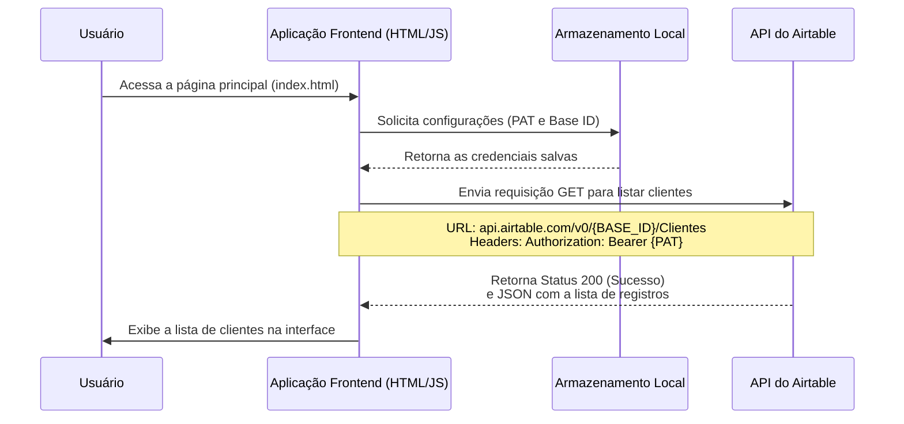

# ☁️ CloudConnect: Gerenciador de Clientes

Este é um web app simples para gerenciar clientes, demonstrando a persistência de dados em nuvem através da API do Airtable. O projeto utiliza **HTML**, **CSS** e **JavaScript** no frontend para realizar operações de CRUD (Create, Read e Delete) de forma assíncrona. A grande inovação aqui é a capacidade de configurar o acesso à API diretamente na interface, usando o **`localStorage`** para persistir as credenciais.

## 🎯 Objetivo

O objetivo principal desta aplicação é consolidar conhecimentos sobre:

  * **APIs REST:** Comunicação com um serviço de nuvem.
  * **Requisições HTTP:** Uso dos verbos `GET`, `POST` e `DELETE`.
  * **Autenticação por token:** Segurança básica com `Bearer Token`.
  * **Manipulação de JSON:** Formatação de dados para envio e recebimento.
  * **Armazenamento no Navegador:** Uso de `localStorage` para persistir as configurações.
  * **UX Básica:** Gerenciamento do estado da UI (`carregando`, `erro`, etc.).

## 📦 Estrutura do Projeto

  * `index.html`: A página principal da aplicação, onde os clientes são listados e um formulário para adicionar novos é exibido.
  * `settings.html`: Uma página dedicada para configurar o **Personal Access Token (PAT)** e o **Base ID** do Airtable, salvando-os no `localStorage` do navegador.
  * `script.js`: O cérebro da aplicação principal. Ele lida com a lógica de listar, adicionar e excluir clientes, comunicando-se diretamente com a API do Airtable.
  * `settings.js`: O script responsável pela lógica da página de configurações, salvando e carregando as credenciais no `localStorage`.
  * `style.css`: A folha de estilo que garante uma interface de usuário limpa e moderna.

## ⚙️ Configuração e Instalação

### Pré-requisitos

1.  Uma conta no **Airtable**.
2.  Crie uma nova **Base** (ex: `DBX_CloudConnect`).
3.  Crie uma **Tabela** (ex: `Clientes`) com os campos `Nome` (Texto), `Email` (E-mail) e `Telefone` (Número de telefone).
4.  **Gere um Personal Access Token (PAT)** na sua conta do Airtable. Certifique-se de que o token tenha permissão de leitura (`data.records:read`) e escrita (`data.records:write`) na base criada.

### Variáveis de Configuração

Ao contrário de outros projetos que usam variáveis de ambiente, este projeto permite que você configure suas credenciais diretamente na interface da página `settings.html`. O `script.js` e o `settings.js` utilizam a API `localStorage` do navegador para armazenar de forma persistente os valores de **PAT** e **Base ID** que você fornecer.

## 🚀 Como Rodar

1.  **Clone este repositório** (ou copie os arquivos).
2.  Abra o arquivo `index.html` em seu navegador web.
3.  Clique no botão "Configurar API Airtable" para ir à página `settings.html`.
4.  Insira seu **Personal Access Token (PAT)** e o **Base ID** do Airtable nos campos correspondentes.
5.  Clique em "Salvar Configurações".
6.  Volte para a página principal. A lista de clientes será carregada automaticamente a partir da sua base no Airtable, e você poderá usar o formulário para adicionar novos registros.

## 🗺️ Diagrama de Sequência

O diagrama a seguir ilustra o fluxo de dados para a operação de listagem de clientes (requisição **`GET`**):

-----

## 🔒 Considerações sobre Segurança

Este projeto armazena suas credenciais da API no **`localStorage` do navegador**, o que as torna acessíveis a qualquer pessoa que use o mesmo navegador para inspecionar o código ou o armazenamento local. Essa abordagem é **insegura para projetos em produção** e é utilizada aqui apenas para fins didáticos. **Em um ambiente real, um servidor intermediário (proxy) é a forma correta de esconder o token**, garantindo que as credenciais nunca saiam do lado do servidor.
